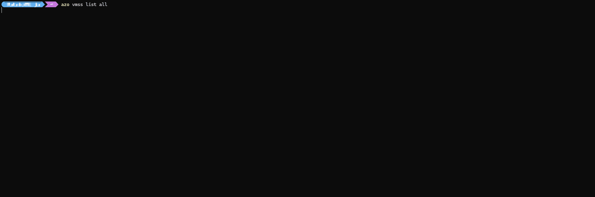
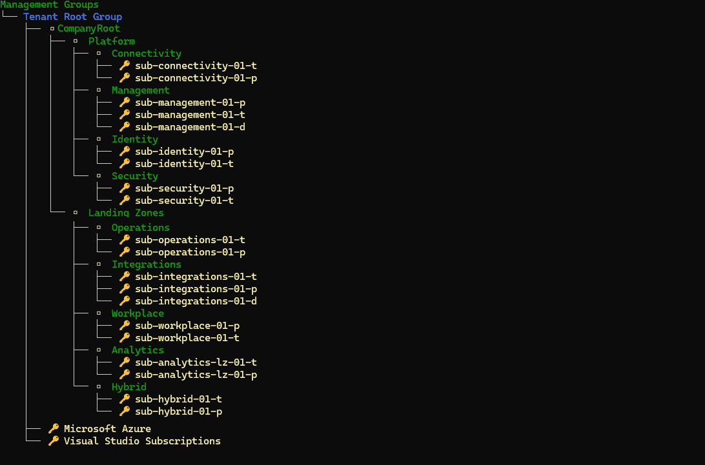

# `Azure Ops CLI - azo`

A graphical Azure CLI inspired by `Spectre.Console`.  
Instead of repeatedly asking questions with Azure CLI or creating scripts, you can retrieve resources and perform bulk actions directly in the CLI with a graphical experience, see [Screenshots](#screenshots).  

For example, updating one or more Virtual Machine Scale Sets with a new image, starting, stopping, or restarting one or more Virtual Machines or Container Instances by selecting them in a list.  

This is a hobby project and is maintained to the best of my ability, I am not a software developer.  
The ambition with this project is to code for fun, but also to create something useful. :computer:  
More functionality and improvements will be added over time.  

At this point, this tool may not be the best option if you have a large number of subscriptions or resources, as the lists can become very long.
Many list commands now support `--filter` and `--export` options to help manage large result sets.

There are probably tons of typos, ambiguities or other oddities, you are welcome to provide feedback so I can address them, thank you! :star:

## Table of Contents

- [Features](#features)
- [Installation](#installation)
- [Usage](#usage)
- [Examples](#examples)
- [Screenshots](#screenshots)
- [Known Issues](#known-issues)

## Features

- API Management:  `apim` -> `list | backup`
- Azure Container Instances: `aci` ->  `list | start | stop | restart | delete | getlogs`
- Azure Compute Gallery: `imagegallery` -> `list`
- Azure Compute Gallery Images: `imagegallery images` -> `list`
- Managed Disks: `disk` -> `list | list-unattached | snapshot | delete` (with filter and export support)
- Management Group:  `mg` -> `show`
- Metrics: `metrics vm` -> `all | subscription` (CPU, memory, disk, network metrics)
- Resource Groups: `rg` -> `list | create` (with filter, export, and --tags support)
- Resource Locks: `lock` -> `list | apply | remove` (CanNotDelete or ReadOnly locks)
- Resource Tags: `tags` -> `list | apply | remove | export`
- Virtual Machines:  `vm` -> `list | start | stop | restart | delete` (with filter and export support)
- Virtual Machines Scale Sets: `vmss` -> `list | start | stop | restart | delete | changeimage | reimage | upgrade`
- Virtual Machines Scale Sets Instance:  `vmss instance` -> `list | start | stop | restart | reimage | upgrade`
- Info: `info` -> Display information about the tool

## Installation

- Make sure [.Net 8](https://dotnet.microsoft.com/en-us/download/dotnet/8.0) is installed.

- Download the executable from [here](https://github.com/patkje75/AzureOpsCLI/releases/latest).
- Put the executable in a folder that is in the PATH environment variable.

## Usage
The application uses `DefaultAzureCredential`, so use `az login` to authenticate.

Type `azo`, `azo -h|--help` or `azo info` to get help with available commands.

There is an idea behind the command structure; whether it’s logical is for others to judge :grin:  
Think of it like this:  
`<resource type>` `<verb>` `<scope>`

>The scope is always either `all` or `subscription`, where `all` will get **ALL** resource types from **ALL** subscriptions.  
`subscription` will show an list of all subscriptions to select one specific.  

For example: `vmss changeimage all`
>In the example above, you get to choose from a list of ALL virtual machine scale sets you have access to, in order to change the image for them.  
Also note that at this point, one can only select ONE image for the selected virtual machines.

## Examples

### List all virtual machine scale sets in all subscriptions
>azo vmss list all

This command will fetch all subscriptions available and then list all accessible virtual machine scale sets.

### List all virtual machine scale sets in a specific subscription
>azo vmss list subscription

This command will fetch all subscriptions and present in a list, then list all accessible virtual machine scale sets from the selected subscription.

### List VMs with filter and export to CSV
>azo vm list all --filter prod --export csv

This command will list all VMs containing "prod" in their name and export the results to a CSV file.

### Show VM metrics across all subscriptions
>azo metrics vm all

This command will display CPU, memory, disk, and network metrics for all VMs across all subscriptions.

### List all managed disks
>azo disk list all

This command will list all managed disks with their size, type, and attachment status.

### List only unattached disks
>azo disk list-unattached all

This command will list only unattached (orphaned) managed disks across all subscriptions.

### Create snapshots of selected disks
>azo disk snapshot subscription

This command will let you select disks from a subscription and create snapshots of them.

### List resource locks
>azo lock list all

This command will list all resource locks (CanNotDelete or ReadOnly) across all subscriptions.

### Apply a lock to resource groups
>azo lock apply subscription

This command will let you select resource groups and apply a CanNotDelete or ReadOnly lock to prevent accidental deletion.

### Create a resource group with tags
>azo rg create subscription --name my-rg --location westeurope --tags "env=prod;team=devops"

This command will create a resource group with the specified tags applied.

### Show tool information
>azo info

This command displays information about the Azure Ops CLI tool.

## Screenshots

### List all Virtual Machine Scale Sets in all subscriptions

### Upgrade a Virtual Machine Scale Set Instance to the latest model in a specific subscriptions

### List all Virtual Machines in all subscriptions and stop selected ones.

### Visualize Management Group Hierarchy.

## Known Issues
- The console output of the `getlogs` command for Container Instances is messy and needs some work.
- Status messages can be messy when the resource names are of different length, might be some fix in Spectre Console, needs some investigation.